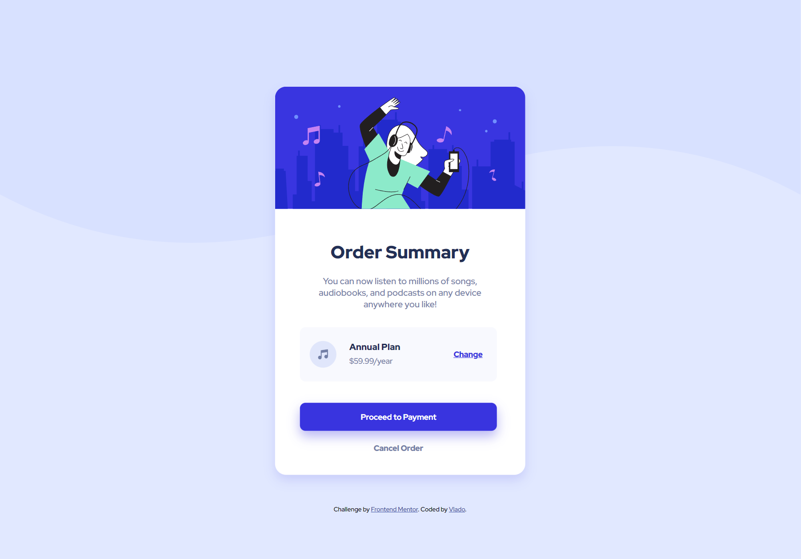

# Frontend Mentor | Order summary card solution

This is a solution to the [Order summary card challenge on Frontend Mentor](https://www.frontendmentor.io/challenges/order-summary-component-QlPmajDUj). Frontend Mentor challenges help you improve your coding skills by building realistic projects.

## Table of contents

- [Overview](#overview)
  - [The challenge](#the-challenge)
  - [Screenshot](#screenshot)
  - [Links](#links)
  - [Built with](#built-with)
  - [What I learned](#what-i-learned)
- [Author](#author)

**Note: Delete this note and update the table of contents based on what sections you keep.**

## Overview

### The challenge

Users should be able to:

- See hover states for interactive elements

### Screenshot



### Links

- Solution URL: [Add solution URL here](https://your-solution-url.com)
- Live Site URL: (https://order-summary-c4rd.netlify.app/)

### Built with

- Semantic HTML5 markup
- CSS custom properties

### What I learned

Biggest problem was the ability to round up the top corners of the svg illustration. First, I tried on the html page, but I couldn't figure it out. Then I switched to CSS with an URL and set the border-radius. It seems super easy, but I got stuck for some time at that point and I am very proud I figure it out 🙂

This is the CSS property for the illustration:

```css
background-image: url("images/illustration-hero.svg");
width: 100%;
height: 220px;
border-radius: 20px 20px 0 0;
```

## Author

- Website - [Vlado](https://dovla.me)
- Frontend Mentor - [@D0vl4](https://www.frontendmentor.io/profile/D0vl4)
